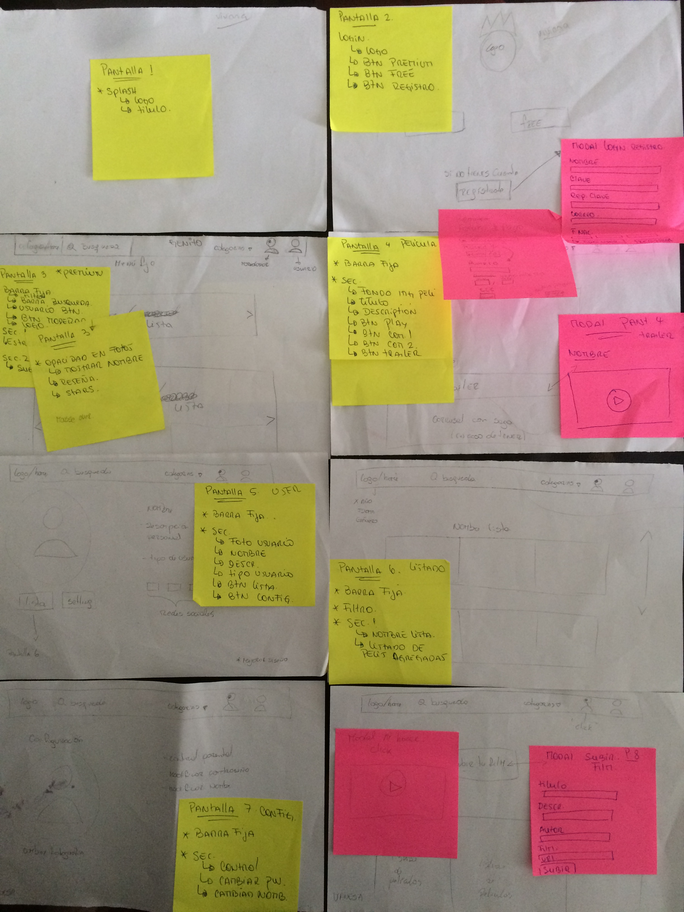
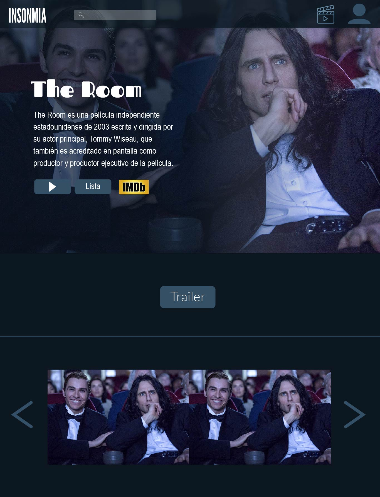
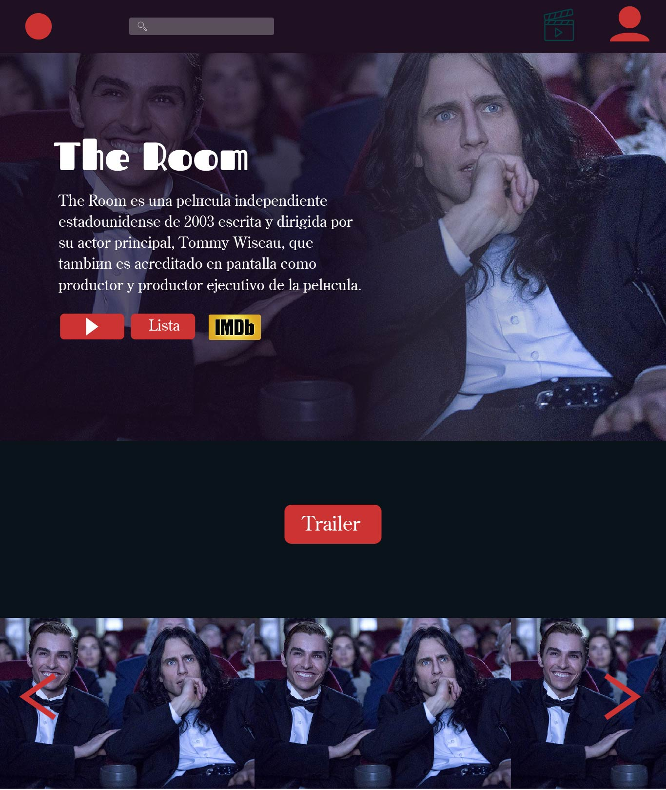
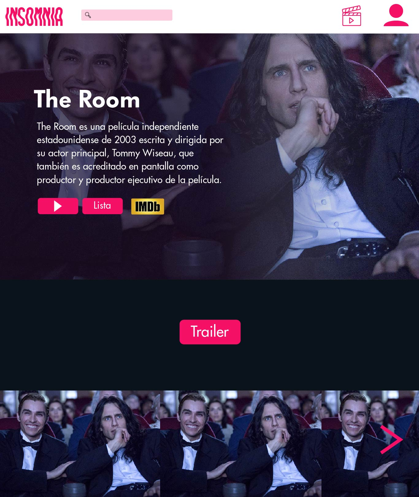
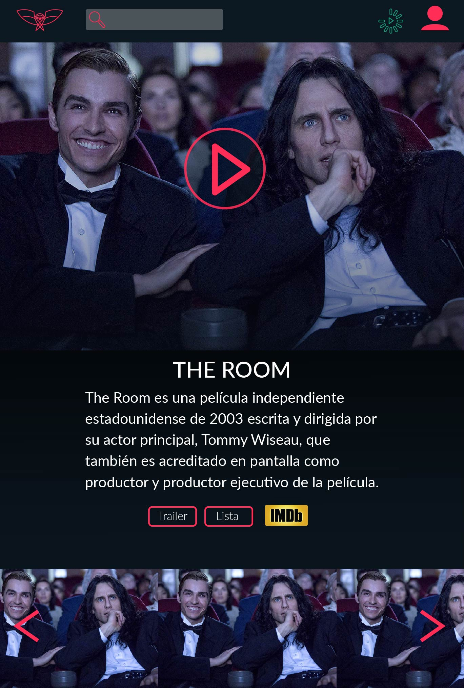

## Challenge Hackathon
Como objetivo general, se pidió crear una solución/producto que resolviera la necesidad del usuario al consumir películas.

## Solución/Producto: 
**INSOMNIA**

### ¿De qué trata?
Es una plataforma online de películas con acceso a cuentas Premium y Free cuya diferencia con el resto es que posee estrenos inmediatos, capacidad de ver las películas directamende desde la plataforma y los más importante es que Insomnia se transforma en una plataforma para cineastas independientes ya que posee una opción en la cuenta Primiun para subir su contenido que pueden ser vistos por clientes Free y Premium.

### ¿Cómo se origina?
Insomnia nació a partir de las inquietudes y falencias que cada una percibia como consumidora de las plataformas existentes en el mercado. Se realizaron propuestas de navegación y de diseño, las cuales fueron decididas mediante votaciones y recibiendo feedback de personas externas al proyecto.

### Público objetivo
+ Dirigido a un público transversal 
+ Cineastas amateur/independientes.

### Diferencia con el mercado
Insomnia tiene como sello la inmediatez de los estrenos.
Es una plataforma de distribución para cineastas independientes.
Registro como usuario free y premium

### Método de trabajo
Nuestro proyecto fue dividido por cada integrante mediante pantallas equitativas y por habilidades propias.
Método que ha permitido avanzar con mayor rapidez y estructurar de una  manera más óptima nuestro producto.

### Planificación
### Día 1 
+ Bocetos

### Dia 2 
+ Propuesta Línea de Diseño

### Día 3 
+ Maquetación

### Día 4
+ Arreglos finales

### Herramientas utilizadas
+ HTML5
+ Javascript
+ jQuery
+ Framework Bootstrap
+ API de Open Movie Database (OMDB) o the movie database.

link
